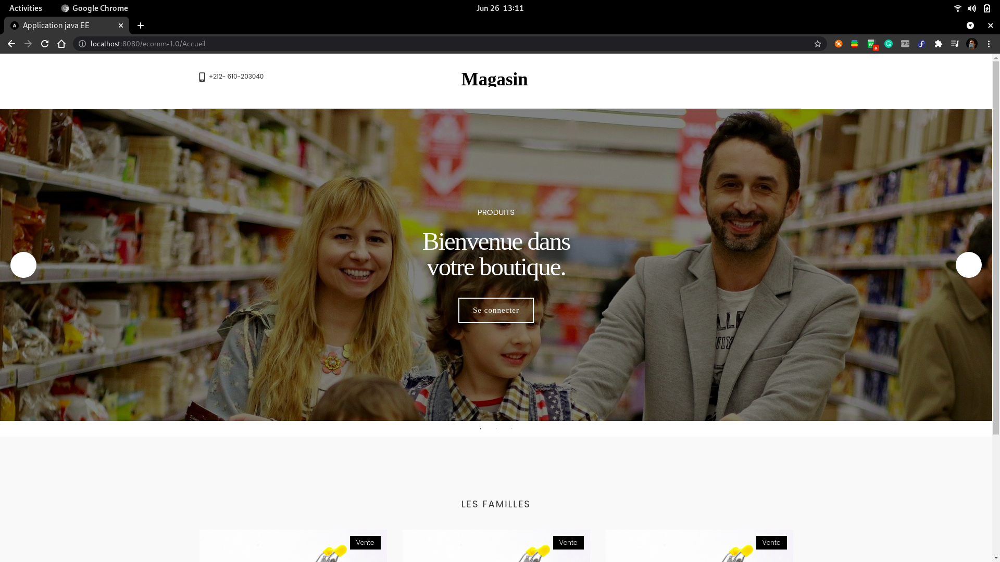
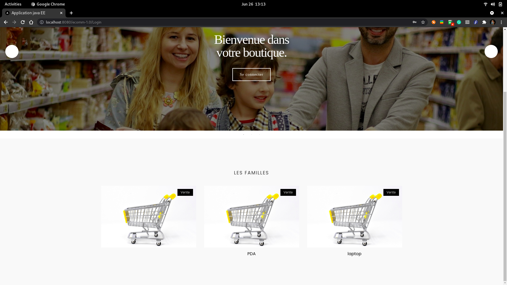
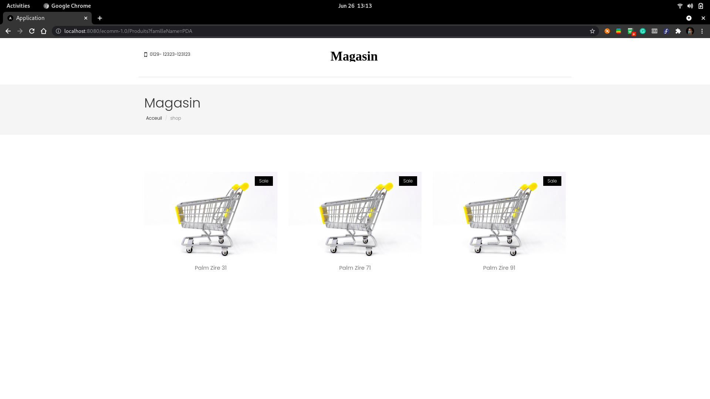
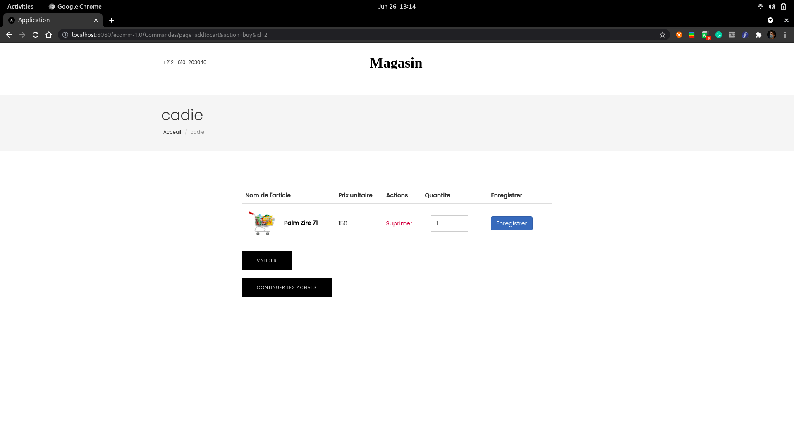
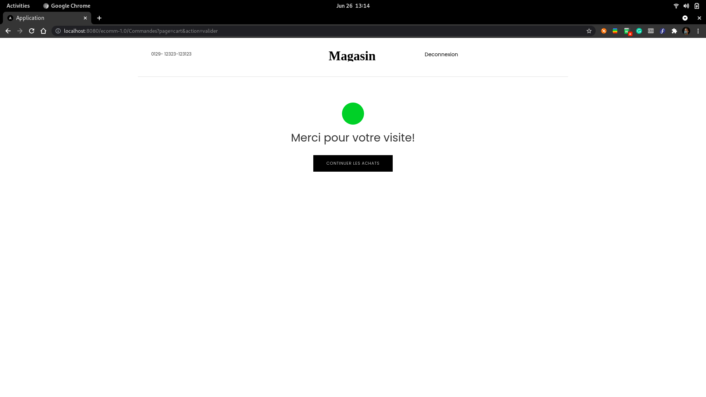
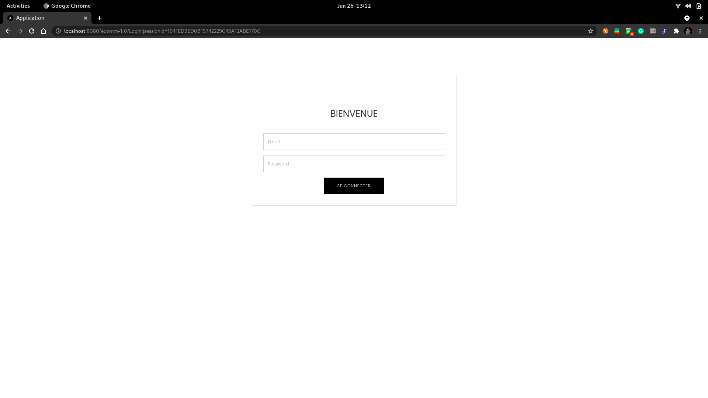
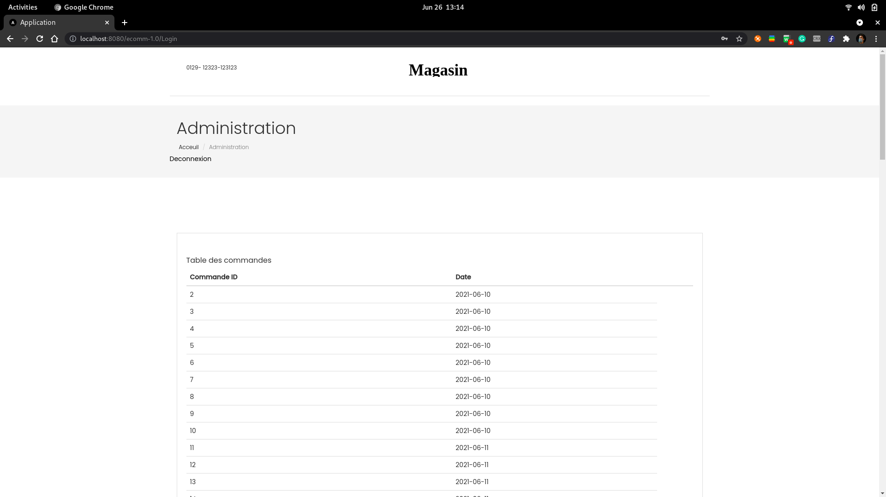

# Ecomm

   

## Présentation du projet

Application JavaEE qui représente un site web e-commerce. 

>### L'utilisateur peut

* navige parmi les familles;

* sélectionne une famille;

---

* obtient les produits de la famille sélectionnée;

* place un item dans le cadie;
* choisir la quantité;

---

* le cadie est accessible toujours;
* dans la page de cadie il peux CRUD les itmes/quantité;
* enregistrement de la commande;
* validation de la commande;

---

* authentification;

---

* l'administrateur peut consulter la liste des commandes

